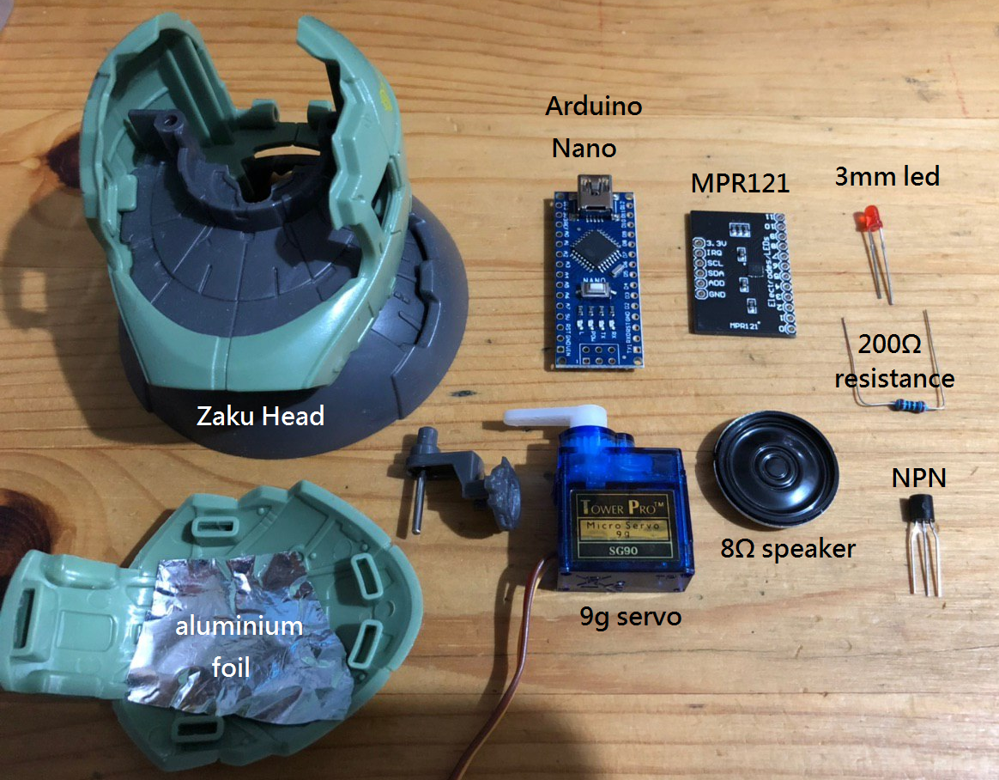
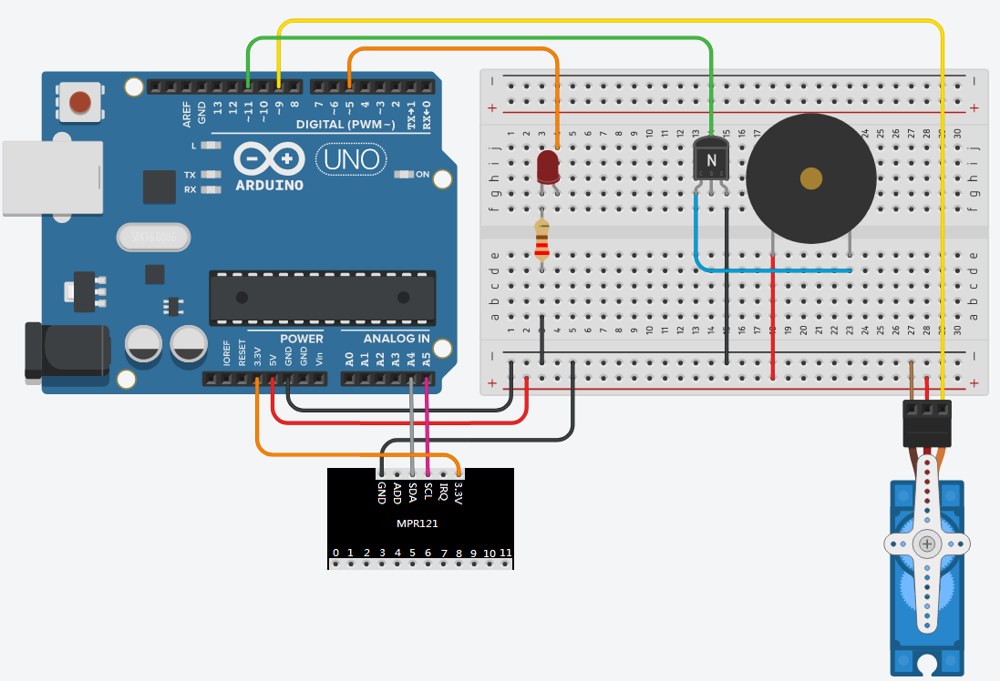

# ZakuHead
### Demo

    move splitPCM to C:\Users\username\Documents\Arduino\libraries

### Requirements
* Arduino nano
* MRP121
* 3mm/5mm led
* 220R resistance
* NPN
* speaker
* servo
* aluminium foil
* Zaku head model
* wire

### Wiring

